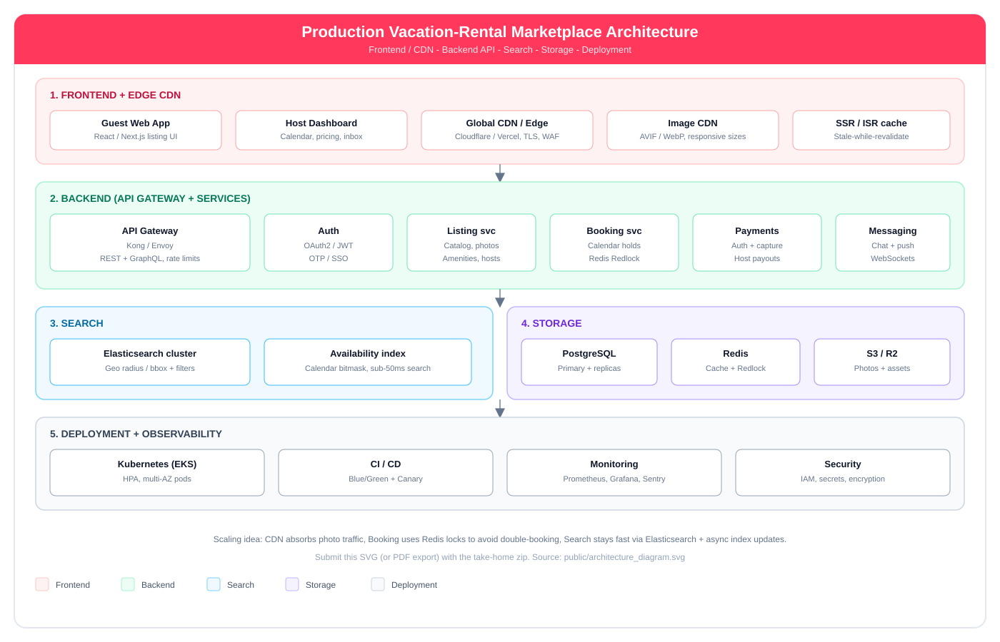

# Production Vacation-Rental Marketplace Architecture

One high-level diagram covering what the take-home asks for: **frontend**, **backend**, **storage**, **search**, and **deployment**.

## Diagram

File to submit: `public/architecture_diagram.svg`  
(Open in browser → Print → Save as PDF if email needs PDF.)

---

## Scaling strategy (short)

### 1. Frontend + Edge CDN
- React / Next.js listing UI (SSR/ISR)
- Cloudflare / Vercel Edge for TLS, WAF, static assets
- Image CDN (AVIF/WebP) so photo-heavy pages stay fast

### 2. Backend
- API Gateway (Kong / Envoy): REST + GraphQL, rate limits
- Auth: OAuth2 / JWT
- Services: Listing, Booking (Redis Redlock for calendar holds), Payments, Messaging

### 3. Search
- Elasticsearch with geo radius / bounding-box queries
- Availability calendar index for fast date filtering

### 4. Storage
- PostgreSQL primary + read replicas
- Redis for cache + booking locks
- S3 / Cloudflare R2 for listing photos

### 5. Deployment
- Kubernetes (EKS) with HPA
- Blue/Green + Canary CI/CD
- Prometheus, Grafana, Sentry for monitoring
